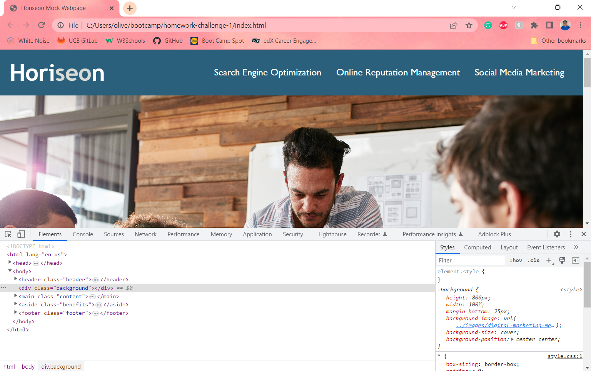

# Homework Challenge 1
UCB Extension Homework Challenge #1: Horiseon Mock Webpage

## Description
This webpage was built as an example for adding semantic HTML, alt attributes to images and consolidating CSS stylesheets. By adding the previous, the webpage is not only accessible to those who may need the abilities of a speech to text program, but with the consolidating of the stylesheet, it also much more accessible to any developer looking to review it. 

## Installation
To view the webpage, simply click on the following link and open in a browser of your choosing (Chrome is recommended). 
[link to deployed webpage](https://otmorales23.github.io/homework-challenge-1/)

## Usage
This webpage is an example and should be used for learning HTML and/or CSS. You can view the source code in Chrome by right clicking on the webpage and selecting inspect, as shown in the following screenshot. 

## Credits
N/A

## License
MIT License

